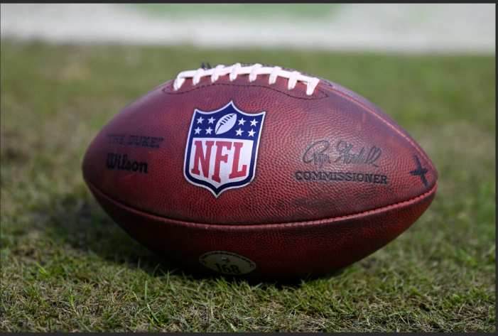
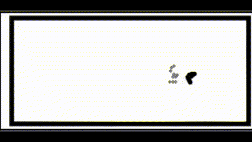
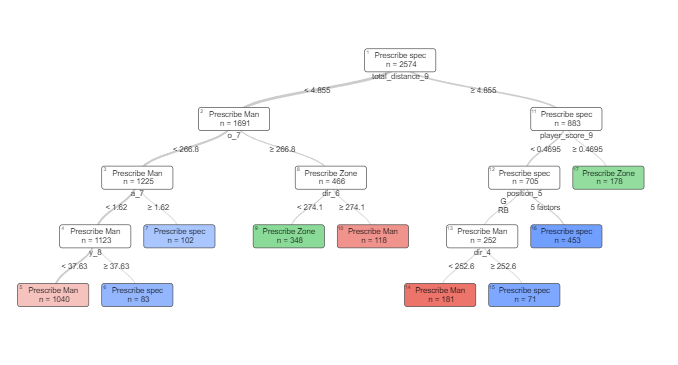

# Project Description

With an average of 21 million viewers per week, the National Football League (NFL) contributes significantly to American culture and entertainment. The annual revenue of the NFL increased to $20.2 billion in 2023 as American football continues to gain popularity. What makes the NFL so interesting? Well, the seemingly simple game of progressing an oblong ball down a 120-yard field is surprisingly complex. Offenses must develop strategies to out-maneuver the opposing team while 11 muscular men attempt to prevent the offense from progressing the ball into their endzone. Offensive strategies begin with a pre-snap formation and behavior, providing hints as to what players might do during the play. The 2025 NFL Big Data Bowl centers around these hints and challenges data scientists to use pre-snap information to predict what will happen after the snap. We propose a framework for choosing a defensive strategy that implements counterfactual estimation and Optimal Policy Trees (OPTs), therefore showcasing how machine learning under a modern optimization lens can be applied to the field of sports analytics.

This project does this by using two forms of data. The first being tabular data which is engineered in such a way to have one observation corresponding to one play and video data which was manually created from the tabular data. An example of the video animation is as follows. 

Our goal was to see if we can capture spatial and temporal aspects from the tracking data that was lost during aggregation from the tabular data. A 3D convolutional neural network was then applied to extract embeddings from the videos and then were concatenated to produce an optimal policy tree as below. The player numbers in the tree mostly represent wide receivers indicating that our models capture this as a signifigant player in determining the yards gained on a play given pre-snap data.

The resulting counterfactuals made from our optimal policy tree resulted to an additional 0.55 yards, which is decent considering how little information was put into the model when in comparison to the domain experts of defensive coordinators in the NFL. To read the full paper or the longer results please view the project report. In order to view the jupyter notebooks please view the repo in chrome.

# Contributors
Azfal Peermohammed 

James Pinter
